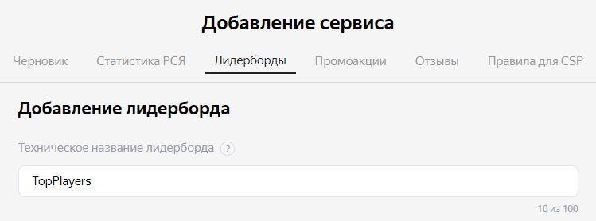

# РАЗРАБОТКА ИГРОВЫХ СЕРВИСОВ
### Ссылка на проект: https://github.com/A-Zaikin/DragonPicker
Отчет по лабораторной работе #5 выполнил:
- Заикин Александр Юрьевич
- РИ300012
Отметка о выполнении заданий (заполняется студентом):

| Задание | Выполнение | Баллы |
| ------ | ------ | ------ |
| Задание 1 | * | 60 |
| Задание 2 | * | 20 |
| Задание 3 | * | 20 |

знак "*" - задание выполнено; знак "#" - задание не выполнено;

Работу проверили:
- к.т.н., доцент Денисов Д.В.
- к.э.н., доцент Панов М.А.
- ст. преп., Фадеев В.О.

## Цель работы
Создание интерактивного приложения с рейтинговой системой пользователя и интеграция игровых сервисов в готовое приложение.

## Задание 1
### Используя видео-материалы практических работ 1-5 повторить реализацию функционала
Ход работы:
#### Работа 1: «Интеграции авторизации с помощью Яндекс SDK»
1) Обновить скрипт авторизации:

```cs
using UnityEngine;
using TMPro;
using YG;
using UnityEngine.Events;

namespace DragonPicker
{
    public class YandexSdkManager : MonoBehaviour
    {
        [SerializeField] private UnityEvent authorizationCheck;

        private bool isFirstLaunch = true;

        public void ResolvedAuthorization()
        {
            Debug.Log($"SDK available\nResolved authorization\nPlayer name: \"{YandexGame.playerName}\"");
        }

        public void RejectedAuthorization()
        {
            Debug.Log($"SDK available\nRejected authorization");
            if (!YandexGame.auth)
            {
                YandexGame.AuthDialog();
            }
        }

        private void OnEnable() => YandexGame.GetDataEvent += SdkDataReceived;

        private void OnDisable() => YandexGame.GetDataEvent -= SdkDataReceived;

        private void SdkDataReceived()
        {
            if (YandexGame.SDKEnabled && isFirstLaunch)
            {
                Debug.Log($"SDK available\nWaiting for authorization...");
                authorizationCheck?.Invoke();
                isFirstLaunch = false;
            }
        }
    }
}
```

#### Работа 2: «Сохранение данных пользователя на платформе Яндекс Игры»
1) Добавить максимальный счёт в сохраняемые переменные:
```cs
namespace YG
{
    [System.Serializable]
    public class SavesYG
    {
        public bool isFirstSession = true;
        public string language = "ru";
        public bool feedbackDone;
        public bool promptDone;

        // Ваши сохранения
        public int maxScore;
    }
}
```
2) Добавить сохранение максимального счёта в GameplayManager:
```cs
public void IncreaseScore()
{
    score++;
    if (score > YandexGame.savesData.maxScore)
    {
        YandexGame.savesData.maxScore = score;
        YandexGame.SaveProgress();
    }
    scoreLabel.text = $"Score: {score}";
}
```

#### Работа 3: «Сбор данных об игроке и вывод их в интерфейсе»
1) Создать скрипт MenuManager:
```cs
using TMPro;
using UnityEngine;
using YG;

public class MenuManager : MonoBehaviour
{
    [SerializeField] private TextMeshProUGUI maxScoreLabel;

    private void OnEnable() => YandexGame.GetDataEvent += SdkDataReceived;

    private void OnDisable() => YandexGame.GetDataEvent -= SdkDataReceived;

    private void SdkDataReceived()
    {
        if (YandexGame.SDKEnabled && YandexGame.auth)
        {
            maxScoreLabel.text = $"Best score: {YandexGame.savesData.maxScore}";
        }
    }
}
```
2) Добавить на сцену панель с "Best score".


3) Добавить на сцену World Canvas и над игроком разместить текстовое поле с его именем.


4) Добавить код в GameplayManager:

```cs
private void OnEnable() => YandexGame.GetDataEvent += SdkDataReceived;

private void OnDisable() => YandexGame.GetDataEvent -= SdkDataReceived;

private void SdkDataReceived()
{
    if (YandexGame.SDKEnabled && YandexGame.auth)
    {
        playerNameLabel.text = YandexGame.playerName;
    }
}
```

#### Работа 4: «Интеграция таблицы лидеров»
1) Добавить сохранение максимального счёта в лидерборд:
```cs
YandexGame.NewLeaderboardScores("TopPlayers", score);
```
2) Зарегистрировать лидерборд в Yandex Консоли.




#### Работа 5: «Интеграция системы достижений в проект»
1) Скачать и импортировать модель персонажа и анимации с mixamo.com.
2) Добавить на сцену префаб мага и настроить AnimationController.
3) Добавить на сцену источники света.
4) Провести сборку приложения.


## Задание 2
### Привести описание того, как происходит сборка проекта проекта под другие платформы. Какие могут быть особенности?
Ход работы:
1) Изменить настройки билда для выбранной платформы -> сделать билд.
2) Устройства ввода могут различаться на разных платформах. Для решения проблемы можно добавить уровень абстракции между кодом для обработки ввода и игровой логикой.
3) На некоторых платформах существуют специальные устройства ввода (акселерометр, GPS, гироскоп). В приложение можно добавить их поддержку.
4) На мобильных устройствах существуют ограничения по памяти и производительности. Возможно, нужно будет провести оптимизацию приложения и размера ассетов на диске.
5) Существуют директивы в коде, которые позволяют исполнять разный код на разных платформах.
```cs
#if UNITY_IOS
    Debug.Log("iOS");
#endif

#if UNITY_STANDALONE_OSX
    Debug.Log("Standalone OSX");
#endif

#if UNITY_STANDALONE_WIN
    Debug.Log("Standalone Windows");
#endif
```

## Задание 3
### Добавить в меню Option возможность изменения громкости (от 0 до 100%) фоновой музыки в игре
Ход работы:
1) Добавить в меню настроек новый UI элемент - слайдер.
2) Добавить в MusicManager новый скрипт:
```cs
using UnityEngine;
using UnityEngine.UI;

public class VolumeLoader : MonoBehaviour
{
    [SerializeField] private string settingsName;
    [SerializeField] private Slider menuSlider;

    private AudioSource audioSource;

    public void SaveVolume(float volume)
    {
        audioSource.volume = volume;
        PlayerPrefs.SetFloat(settingsName, volume);
        PlayerPrefs.Save();
    }

    private void Awake()
    {
        audioSource = GetComponent<AudioSource>();
        if (!PlayerPrefs.HasKey(settingsName))
        {
            return;
        }

        var volume = PlayerPrefs.GetFloat(settingsName);
        audioSource.volume = volume;
        if (menuSlider != null)
        {
            menuSlider.value = volume;
        }
    }
}
```
3) On WebGL, Unity stores up to 1MB of PlayerPrefs data using the browser's IndexedDB API.


https://user-images.githubusercontent.com/82456483/198529215-beb437af-fc63-4860-942e-4f5721e59b99.mp4


## Выводы

Изучены:
- импортирование моделей и анимаций,
- создание нескольких сцен и переключение между ними,
- создание базового меню,
- добавление звукового сопровождения и настроек громкости.

## Powered by

**BigDigital Team: Denisov | Fadeev | Panov**
