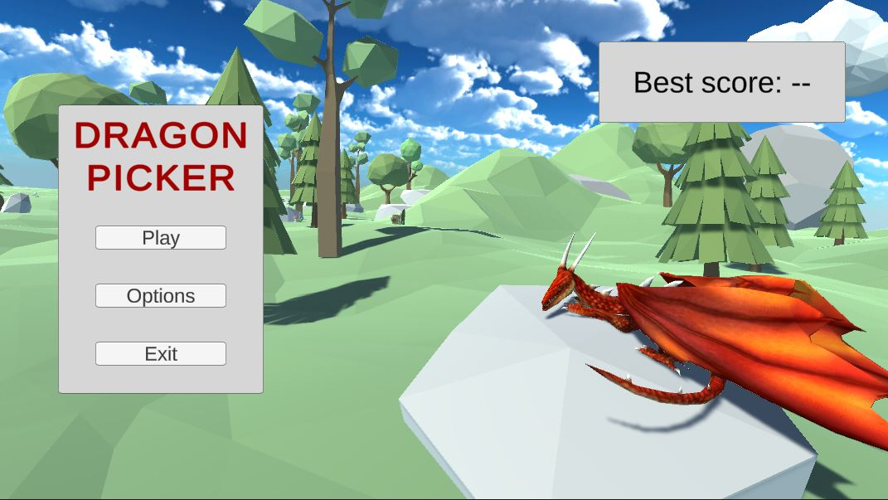

# РАЗРАБОТКА ИГРОВЫХ СЕРВИСОВ
### Ссылка на проект: https://github.com/A-Zaikin/DragonPicker
Отчет по лабораторной работе #5 выполнил:
- Заикин Александр Юрьевич
- РИ300012
Отметка о выполнении заданий (заполняется студентом):

| Задание | Выполнение | Баллы |
| ------ | ------ | ------ |
| Задание 1 | * | 60 |
| Задание 2 | * | 20 |
| Задание 3 | * | 20 |

знак "*" - задание выполнено; знак "#" - задание не выполнено;

Работу проверили:
- к.т.н., доцент Денисов Д.В.
- к.э.н., доцент Панов М.А.
- ст. преп., Фадеев В.О.

## Цель работы
Создание интерактивного приложения с рейтинговой системой пользователя и интеграция игровых сервисов в готовое приложение.

## Задание 1
### Используя видео-материалы практических работ 1-5 повторить реализацию функционала
Ход работы:
#### Работа 1: «Интеграции авторизации с помощью Яндекс SDK»
1) Обновить скрипт авторизации:

```cs
using UnityEngine;
using TMPro;
using YG;
using UnityEngine.Events;

namespace DragonPicker
{
    public class YandexSdkManager : MonoBehaviour
    {
        [SerializeField] private UnityEvent authorizationCheck;

        private bool isFirstLaunch = true;

        public void ResolvedAuthorization()
        {
            Debug.Log($"SDK available\nResolved authorization\nPlayer name: \"{YandexGame.playerName}\"");
        }

        public void RejectedAuthorization()
        {
            Debug.Log($"SDK available\nRejected authorization");
            if (!YandexGame.auth)
            {
                YandexGame.AuthDialog();
            }
        }

        private void OnEnable() => YandexGame.GetDataEvent += SdkDataReceived;

        private void OnDisable() => YandexGame.GetDataEvent -= SdkDataReceived;

        private void SdkDataReceived()
        {
            if (YandexGame.SDKEnabled && isFirstLaunch)
            {
                Debug.Log($"SDK available\nWaiting for authorization...");
                authorizationCheck?.Invoke();
                isFirstLaunch = false;
            }
        }
    }
}
```

#### Работа 2: «Сохранение данных пользователя на платформе Яндекс Игры»
1) Добавить максимальный счёт в сохраняемые переменные:
```cs
namespace YG
{
    [System.Serializable]
    public class SavesYG
    {
        public bool isFirstSession = true;
        public string language = "ru";
        public bool feedbackDone;
        public bool promptDone;

        // Ваши сохранения
        public int maxScore;
    }
}
```
2) Добавить сохранение максимального счёта в GameplayManager:
```cs
public void IncreaseScore()
{
    score++;
    if (score > YandexGame.savesData.maxScore)
    {
        YandexGame.savesData.maxScore = score;
        YandexGame.SaveProgress();
    }
    scoreLabel.text = $"Score: {score}";
}
```

#### Работа 3: «Сбор данных об игроке и вывод их в интерфейсе»
1) Создать скрипт MenuManager:
```cs
using TMPro;
using UnityEngine;
using YG;

public class MenuManager : MonoBehaviour
{
    [SerializeField] private TextMeshProUGUI maxScoreLabel;

    private void OnEnable() => YandexGame.GetDataEvent += SdkDataReceived;

    private void OnDisable() => YandexGame.GetDataEvent -= SdkDataReceived;

    private void SdkDataReceived()
    {
        if (YandexGame.SDKEnabled && YandexGame.auth)
        {
            maxScoreLabel.text = $"Best score: {YandexGame.savesData.maxScore}";
        }
    }
}
```
2) Добавить на сцену панель с "Best score".



3) Добавить на сцену World Canvas и над игроком разместить текстовое поле с его именем.


4) Добавить код в GameplayManager:

```cs
private void OnEnable() => YandexGame.GetDataEvent += SdkDataReceived;

private void OnDisable() => YandexGame.GetDataEvent -= SdkDataReceived;

private void SdkDataReceived()
{
    if (YandexGame.SDKEnabled && YandexGame.auth)
    {
        playerNameLabel.text = YandexGame.playerName;
    }
}
```

#### Работа 4: «Интеграция таблицы лидеров»
1) Добавить сохранение максимального счёта в лидерборд:
```cs
YandexGame.NewLeaderboardScores("TopPlayers", score);
```
2) Зарегистрировать лидерборд в Yandex Консоли.


#### Работа 5: «Интеграция системы достижений в проект»
1) Добавить в сохранения id достижений:
```cs
public int[] achievementIds = Array.Empty<int>();
```
2) Создать класс AchievementManager:
```cs
using System;
using System.Collections.Generic;
using System.Linq;
using Unity.VisualScripting;
using UnityEngine;
using YG;

public class AchievementManager : MonoBehaviour
{
    [SerializeField] private List<string> achievements;

    public static AchievementManager Instance;
    public List<string> CompletedAchievements { get; private set; } = new();

    private void OnEnable() => YandexGame.GetDataEvent += SdkDataReceived;

    private void OnDisable() => YandexGame.GetDataEvent -= SdkDataReceived;

    public void CompleteAchievement(int id)
    {
        if (!YandexGame.savesData.achievementIds.Contains(id))
        {
            YandexGame.savesData.achievementIds = YandexGame.savesData.achievementIds.Append(id).ToArray();
            YandexGame.SaveProgress();
        }
    }

    private void SdkDataReceived()
    {
        if (!YandexGame.SDKEnabled || !YandexGame.auth)
        {
            return;
        }

        var sortedIds = YandexGame.savesData.achievementIds.Clone() as int[];
        Array.Sort(sortedIds);
        CompletedAchievements.AddRange(sortedIds.Select(id => achievements[id]));
    }

    private void Awake()
    {
        if (Instance == null)
        {
            Instance = this;
        }
    }

    private void Start()
    {
        SdkDataReceived();
    }
}
```
3) Добавить в префаб менеджера достижения.


4) Создать класс AchievementMenu, который заполняет текстовое поле достижений:
```cs
using System;
using TMPro;
using UnityEngine;
using YG;

public class AchievementsMenu : MonoBehaviour
{
    [SerializeField] private TextMeshProUGUI achievementsText;

    private void OnEnable() => YandexGame.GetDataEvent += SdkDataReceived;

    private void OnDisable() => YandexGame.GetDataEvent -= SdkDataReceived;

    private void SdkDataReceived()
    {
        if (!YandexGame.SDKEnabled || !YandexGame.auth)
        {
            return;
        }

        achievementsText.text = string.Empty;
        foreach (var achievement in AchievementManager.Instance.CompletedAchievements)
        {
            achievementsText.text += achievement + '\n';
        }
    }

    private void Start()
    {
        SdkDataReceived();
    }
}
```


## Задание 2
### Описать не менее трех дополнительных функций Яндекс SDK, которые могут быть интегрированы в игру.
1) Оценка игры. Вы можете попросить пользователя оценить игру и написать комментарий во всплывающем окне (появится в момент запроса оценки, закрывая фон приложения). Всплывающее окно не будет показано, если пользователь неавторизован или оценивал игру ранее.
2) Внутриигровые покупки. Вы можете получать доход, предоставив пользователям возможность совершать покупки в игре. Например, дополнительное время на прохождение уровня или аксессуары для игрового персонажа.
3) Ярлык на рабочий стол. С помощью нативного диалогового окна вы можете предложить пользователю добавить на рабочий стол ярлык — ссылку на игру.
4) Баннерная реклама. Вы можете получать доход от размещения рекламных блоков в своих играх.

## Задание 3
### Доработать стилистическое оформление списка лидеров и системы достижений, реализованных в задании 1.
Ход работы:
1) Добавить класс ассета-достижения:
```cs
using System;
using UnityEngine;

[CreateAssetMenu(menuName = "Dragon Picker/Achievement")]
[Serializable]
public class AchievementSO : ScriptableObject
{
    [field: SerializeField] public int Id { get; private set; }
    [field: SerializeField] public string Title { get; private set; }
    [field: SerializeField, TextArea] public string Description { get; private set; }
    [field: SerializeField] public Sprite Image { get; private set; }
}
```
2) Обновить класс AchievementManager на использование ассетов:
```cs
[SerializeField] private List<AchievementSO> achievements;
public List<AchievementSO> CompletedAchievements { get; private set; } = new();
```
3) Создать префаб UI элемента достижения:


4) В AchievementMenu добавить код создания UI элемента из ассета:
```cs
private void CreateUI()
{
    var contentContainer = transform.Find("ScrollView/Viewport/HorizontalLayout");
    foreach (var achievement in AchievementManager.Instance.CompletedAchievements)
    {
        var achievementUI = Instantiate(achievementPrefab, contentContainer);
        achievementUI.transform.Find("Inner/Image").GetComponent<Image>().sprite = achievement.Image;
        achievementUI.transform.Find("Inner/Title").GetComponent<TextMeshProUGUI>().text = achievement.Title;
        achievementUI.transform.Find("Inner/Description").GetComponent<TextMeshProUGUI>().text = achievement.Description;
    }

    // test achievements
    for (var i = 0; i < 5; i++)
    {
        Instantiate(achievementPrefab, contentContainer);
    }
}
```
5) Настроить панель с достижениями на использование прокручивания:
   - добавить в ScrollView компонент "Scroll Rect"
   - добавить в Viewport компоненты "Mask" и "Image" со спрайтом UIMask 
   - добавить в VerticalLayout компоненты "Vertical Layout Group" и "Content Size Fitter"
   - добавить в Scrollbarr компонент "Scrollbar"
   - настройть работу компонентов между собой


6) Создать несколько достижений и добавить их в AchievementManager.


7) Скопировать ассет "Leaderboard Advanced" из плагина YandexGame, изменить внешний вид и настроить на использование нашего лидерборда "TopPlayers".


## Выводы

Изучены:
- авторизация пользователей используя API,
- сохранение данных пользователя на облаке,
- создание системы достижений,
- более продвинутые функции системы интерфейса uGUI,
- работа с лидербордами.

## Powered by

**BigDigital Team: Denisov | Fadeev | Panov**
